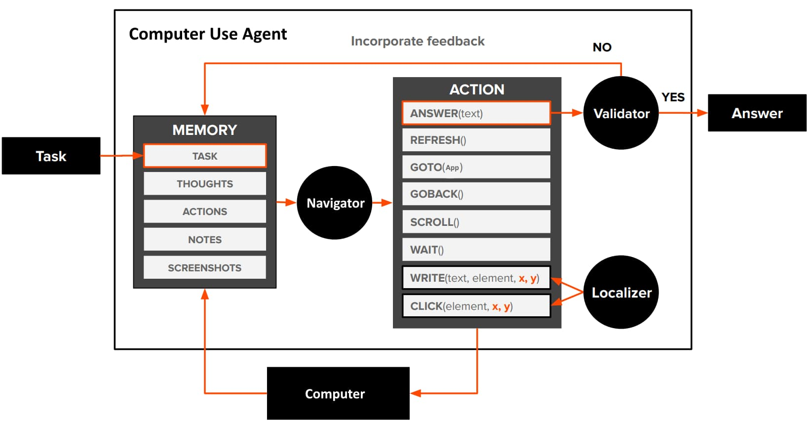

<h1 align="center">Computer Use Agent</h1>

<p align="center">
  <strong>An autonomous computer control agent powered by Vision-Language Models</strong>
</p>

<p align="center">
  
  
  
</p>

<p align="center">
  <a href="#installation"><b>Get Started →</b></a>
</p>

<br>

<p align="center">
  <video src="imgs/demo.mp4" width="700" controls></video>
</p>

<br>

---

## 📰 Updates

| Date | Version | Changes |
|------|---------|---------|
| Feb 2026 | **v2.0** | Upgraded to [Holo2-4B](https://huggingface.co/Hcompany/Holo2-4B) - improved accuracy and reasoning |
| June 2025 | **v1.0** | Initial release with [Holo1.5-3B](https://huggingface.co/Hcompany/Holo1.5-3B) |

---

## Overview

Computer Use Agent is an autonomous system that can control your computer to complete tasks. Give it a high-level goal like *"Search for flights to New York"* and watch it navigate, click, type, and interact with your desktop - all powered by a local Vision-Language Model.

The agent uses a **tri-role architecture**:
- **Navigator** - Analyzes screenshots and decides the next action
- **Localizer** - Finds exact coordinates of UI elements  
- **Validator** - Confirms actions were successful (optional)

<br>

## 🚀 Features

| Feature | Description |
|---------|-------------|
| **Autonomous Mode** | Set a goal and let the agent work independently |
| **Manual Testing** | Test localization, navigation, and validation separately |
| **Speed Presets** | Quality, Balanced, Fast, Fastest - trade accuracy for speed |
| **Real-time Streaming** | Watch the model think and reason live |
| **Stop Control** | Interrupt the agent at any time |
| **Thinking Mode** | Enable/disable chain-of-thought reasoning |

<br>

## 🏗️ Architecture

<p align="center">
  
</p>

<br>

## ⚡ Tech Stack

| Library | Purpose |
|---------|---------|
| [PyTorch](https://pytorch.org/) | Deep learning framework |
| [Transformers](https://huggingface.co/docs/transformers) | Model loading and inference |
| [Gradio](https://gradio.app/) | Web interface |
| [PyAutoGUI](https://pyautogui.readthedocs.io/) | Mouse and keyboard control |
| [mss](https://python-mss.readthedocs.io/) | Fast screen capture |
| [Pydantic](https://docs.pydantic.dev/) | Data validation |
| [bitsandbytes](https://github.com/TimDettmers/bitsandbytes) | 8-bit quantization |

<br>

## Requirements

**Hardware**
- NVIDIA GPU with 8GB+ VRAM (tested on RTX 4070 Laptop)
- 16GB+ RAM recommended

**Software**
- Python 3.10+
- CUDA 11.8+
- Windows 10/11

<br>

## Installation

1. **Clone the repository**
   ```bash
   git clone https://github.com/yourusername/Computer-Use-Agent.git
   cd Computer-Use-Agent
   ```

2. **Install dependencies**
   ```bash
   pip install torch torchvision --index-url https://download.pytorch.org/whl/cu118
   pip install transformers gradio pyautogui mss pydantic pillow bitsandbytes
   ```

3. **Download the model**
   
   Download [Holo2-4B](https://huggingface.co/Hcompany/Holo2-4B) from HuggingFace and place it in your preferred directory. Update the `MODEL_PATH` in `core/model.py`:
   ```python
   MODEL_PATH = r"C:\AI\Holo2-4B"  # change this to your path
   ```

4. **Run the agent**
   ```bash
   python agent.py
   ```

5. **Open the UI**
   
   Navigate to `http://localhost:7860` in your browser.

<br>

## Usage

### Autonomous Mode
1. Enter a task description (e.g., *"Open Notepad and type Hello World"*)
2. Select speed preset (Balanced recommended)
3. Click **Start Agent**
4. A new browser tab opens automatically - the agent will work there

### Speed Presets
| Preset | Resolution | Use Case |
|--------|------------|----------|
| Quality | 1280px | Best accuracy, slower |
| Balanced | 896px | Good balance |
| Fast | 768px | Faster, still accurate |
| Fastest | 512px | Maximum speed, may miss small elements |

### Manual Testing
Use the other tabs to test individual components:
- **Localization** - Upload screenshot, describe element, get coordinates
- **Navigation** - Upload screenshot, describe task, get next action
- **Validator** - Verify if an action was successful

<br>

## Project Structure

```
Computer-Use-Agent/
├── agent.py              # entry point
├── core/
│   ├── __init__.py
│   ├── model.py          # model loading & inference
│   ├── actions.py        # action classes & execution
│   └── prompts.py        # prompt templates
└── ui/
    ├── __init__.py
    └── gradio_app.py     # web interface
```

<br>

## Model

This project uses **Holo2-4B** from Hcompany, a Vision-Language Model fine-tuned for GUI understanding and computer control tasks.

| Model | Parameters | Link |
|-------|------------|------|
| Holo2-4B | 4B | [huggingface.co/Hcompany/Holo2-4B](https://huggingface.co/Hcompany/Holo2-4B) |
| Holo1.5-3B | 3B | [huggingface.co/Hcompany/Holo1.5-3B](https://huggingface.co/Hcompany/Holo1.5-3B) |

<br>

## Acknowledgments

- [Hcompany](https://huggingface.co/Hcompany) for the Holo models

---

<p align="center">
  <sub>Semester Project - Agentic AI</sub>
  <br>
  <sub>Spring 2025</sub>
</p>
